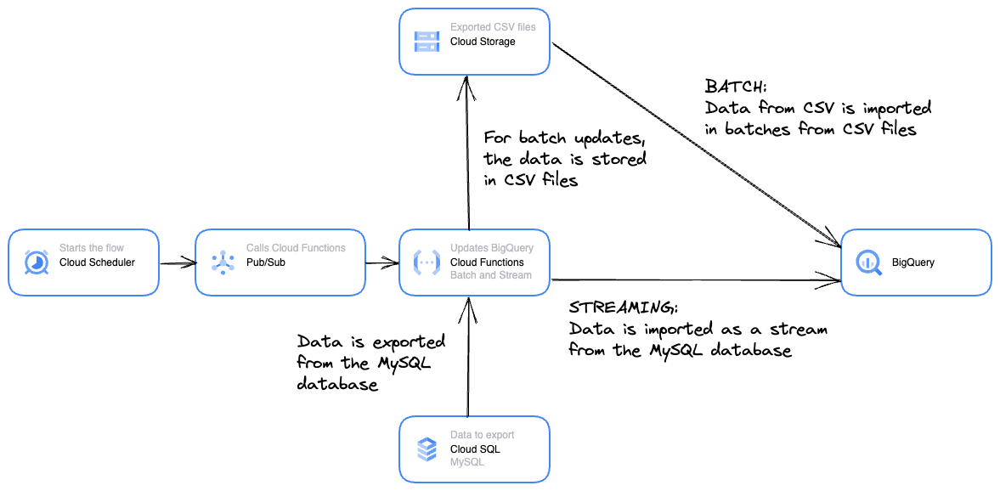

# README

Method: Python client library & CLI

In this example data is exported from a MySQL database on CloudSQL and inserted to BigQuery.

Two methods are used:
- Batch
- Stream

For accessing the MySQL database on Cloud SQL with a GUI tool on local machine, the machines IP address must authorised. \
Add the machines IP by clicking on "Add network" on the following page https://cloud.google.com/sql/docs/mysql/configure-ip


## Actions made by the script ```setup.sh```

- Activate API's
- Create a Cloud Storage bucket and upload files
- Create a MySQL database on Cloud SQL and import data
- Create a dataset and a table on BigQuery, and import data
- Create a topic on Pub/Sub
- Set up a schedule on Cloud Scheduler
- Deploy Python code on Cloud Functions
- CLEANUP
    - Delete all the used services: Storage, Functions, Pub/Sub, Scheduler, Cloud SQL, BigQuery
    - Deactivate the API's


## Installation & run
- Give read&write permissions to the Cloud SQL service account to the bucket where the CSV is exported
- Execute the file ```setup.sh```


</img>